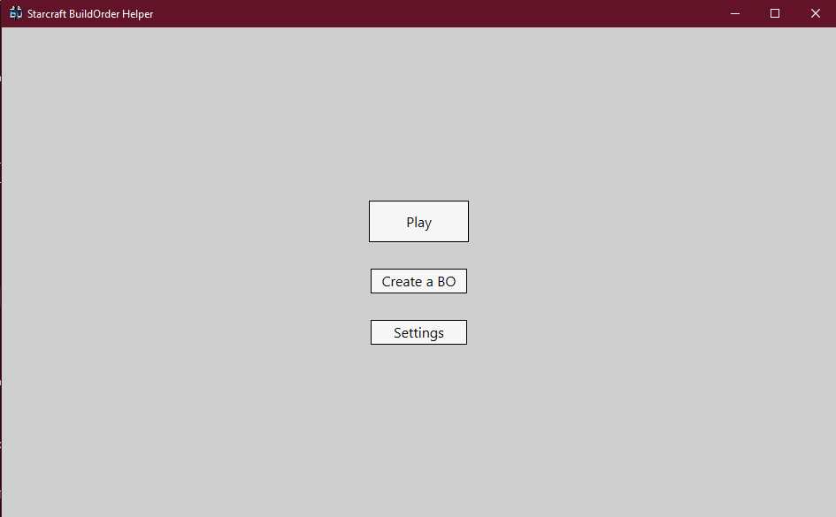
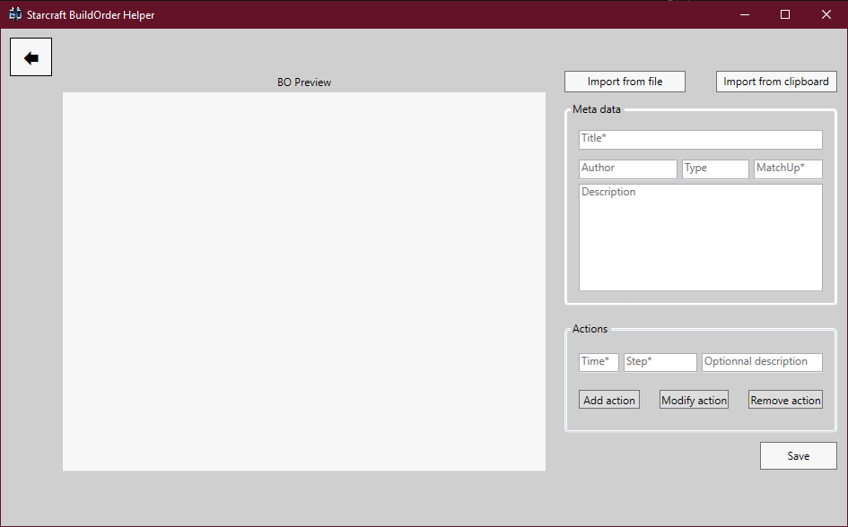
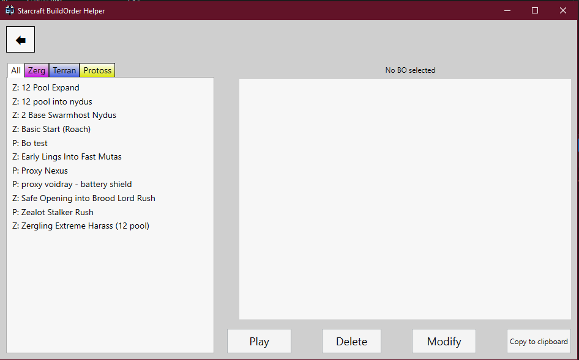

# Starcraft Build Order Helper

## Downlaod 
You can download the latest version here: https://github.com/Pholith/Starcraft-BO-helper/releases

## What is a Build Order ?
In Starcraft II, a build order (BO) is a series of precise actions to be performed at the beginning of a game to optimize its performance. This can result in economic benefits, unpredictable attacks, or other.

## How this application can help you ?
TODO

## Overview

## Documentation
TODO